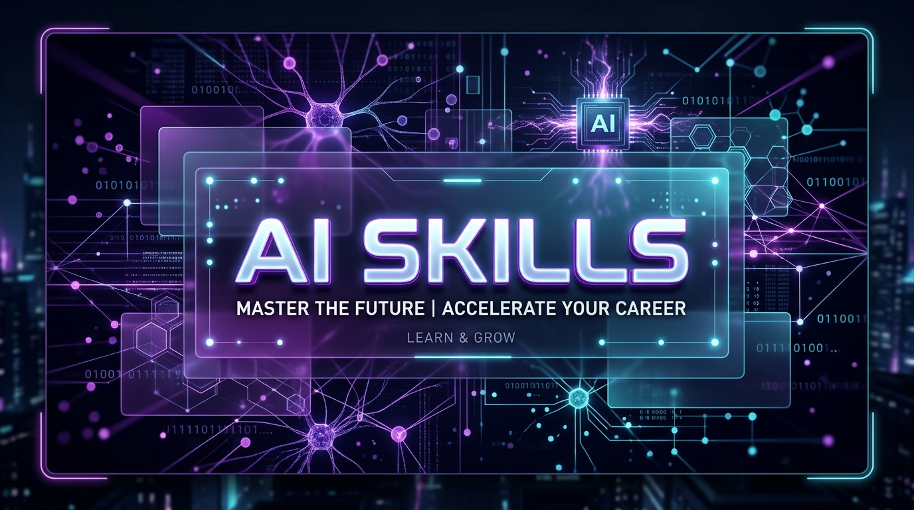
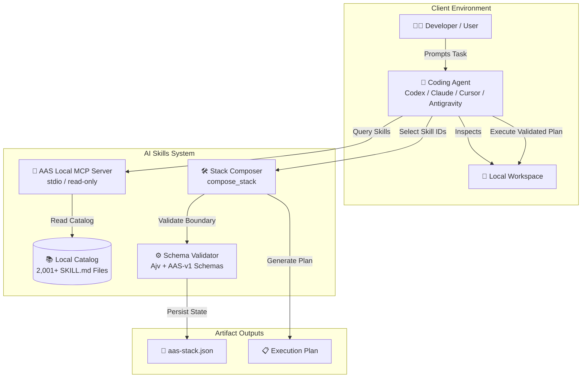
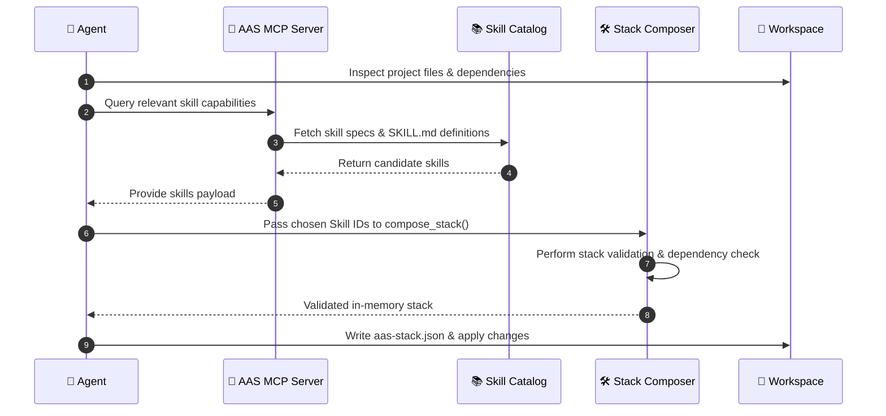

<div align="center">

  

  <br /><br />

  

  <h1>⚡ AI Skills</h1>
  <p><strong>The premier local catalog of 2,001+ agentic coding skills, reproducible plans, and local MCP discovery.</strong></p>

  <p>
    <a href="https://github.com/yugsuthar208/ai-skills/releases"></a>
    <a href="https://github.com/yugsuthar208/ai-skills/blob/main/LICENSE"></a>
    
    
  </p>

</div>

---

## 📌 Table of Contents
- [🌟 Overview](#-overview)
- [📐 Visual System Architecture](#-visual-system-architecture)
- [🔄 Skill Resolution Lifecycle](#-skill-resolution-lifecycle)
- [✨ Key Features](#-key-features)
- [📦 Skill Categories & Bundles](#-skill-categories--bundles)
- [💻 CLI & Command Reference](#-cli--command-reference)
- [🔌 Agent Integration Guides](#-agent-integration-guides)
  - [Claude Code](#claude-code)
  - [Cursor](#cursor)
  - [Gemini CLI & Antigravity](#gemini-cli--antigravity)
- [📂 Project Directory Structure](#-project-directory-structure)
- [🤝 Contributing & License](#-contributing--license)

---

## 🌟 Overview

**AI Skills** is a high-performance, local-first skill discovery engine and execution stack tailored for autonomous coding agents (Codex, Claude Code, Cursor, Gemini CLI, Antigravity, and custom LLM agents).

Unlike cloud-dependent skill registries, **AI Skills** provides **2,001+ pre-packaged, validated agentic skills** directly on your file system. Coding agents can inspect project contexts, query local skill catalogs via MCP (Model Context Protocol), validate stack boundaries, and generate reproducible `aas-stack.json` plans prior to taking action.

> **Maintained & Created by**: **yug**  
> **Repository**: [github.com/yugsuthar208/ai-skills](https://github.com/yugsuthar208/ai-skills)

---

## 📐 Visual System Architecture

The following diagram illustrates how AI Skills coordinates local skill selection and validation between coding agents and your workspace:



---

## 🔄 Skill Resolution Lifecycle



---

## ✨ Key Features

- 🧠 **Agent-First Selection**: Complete catalog access allows AI agents to intelligently select precise skills matching project requirements.
- ⚡ **Local MCP Server**: Embedded Model Context Protocol server (`aas-mcp`) provides fast, read-only local stdio access.
- 🛡️ **Strict Stack Validation**: In-memory boundary validation prevents conflicting skills, broken imports, or missing dependencies.
- 📜 **Reproducible Artifacts**: Generates standardized `aas-stack.json` files and execution plans.
- 🎨 **Web UI Catalog**: Built-in Vite + React app for visual browsing, filtering, and inspecting all 2,001+ skills locally.
- 🔍 **Security & Audit Guardrails**: Built-in security scanners and consistency checks ensure all skills strictly comply with safety guidelines.

---

## 📦 Skill Categories & Bundles

AI Skills comes organized into domain-specific skill bundles for effortless agent navigation:

| Icon | Category / Bundle | Included Capabilities & Focus Areas | Example Skills |
| :---: | :--- | :--- | :--- |
| 🌐 | **Full Stack Development** | Frontend, Backend APIs, Frameworks, Hydration, SSR | `react-components`, `nextjs-routing`, `express-api` |
| 🎨 | **UI / UX & Design Systems** | Modern Aesthetic Specs, Component Tokens, GSAP Animations | `ui-ux-pro-max`, `gsap-core`, `minimalist-ui` |
| 🛡️ | **Security & Hardening** | Vulnerability Audits, Input Sanitization, Auth Patterns | `security-and-hardening`, `security-auditor` |
| 📊 | **Data & Analytics** | ETL Pipelines, Data Visualization, Database Queries | `data-analytics`, `sql-optimizer` |
| ☁️ | **DevOps & Cloud** | CI/CD Automation, Containerization, Infrastructure | `ci-cd-and-automation`, `docker-builder` |
| 📱 | **Mobile Engineering** | React Native, Expo, iOS/Android Native Patterns | `expo-react-native`, `android-cli` |
| 🤖 | **AI & LLM Integration** | Prompt Engineering, RAG Systems, Agentic Workflows | `llm-application-developer`, `context-engineering` |
| 🧪 | **QA & Testing** | Unit Testing, DevTools Profiling, TDD Patterns | `browser-testing-with-devtools`, `test-driven-development` |

---

## 💻 CLI & Command Reference

The root `package.json` contains a suite of management, validation, and development scripts:

| Command | Action / Description |
| :--- | :--- |
| `npm run validate` | Runs standard validation scripts on all `SKILL.md` files. |
| `npm run validate:strict` | Enforces strict schema, heading, and frontmatter requirements. |
| `npm run audit:skills` | Audits skill catalog for missing metadata or broken references. |
| `npm run app:dev` | Launches the local Vite Web UI catalog server. |
| `npm run app:build` | Builds production bundle for the Web UI catalog. |
| `npm run catalog` | Generates the static catalog JSON database artifacts. |
| `npm run security:scan` | Runs local security static analysis over skill definitions. |
| `npm run test` | Executes the complete test suite. |

---

## 🔌 Agent Integration Guides

### Claude Code
Add the AAS MCP server configuration to your `claude.json` or project MCP config:
```json
{
  "mcpServers": {
    "ai-skills": {
      "command": "node",
      "args": ["path/to/ai-skills/tools/bin/aas-mcp.js"]
    }
  }
}
```

### Cursor
In Cursor Settings -> **MCP Servers**, add a new server:
- **Name**: `ai-skills`
- **Type**: `command`
- **Command**: `node path/to/ai-skills/tools/bin/aas-mcp.js`

### Gemini CLI & Antigravity
Copy or symlink local skills to your customization directory:
- Global: `~/.gemini/config/skills/`
- Workspace: `.agents/skills/`

---

## 📂 Project Directory Structure

```text
ai-skills/
├── 📁 apps/
│   └── 📁 web-app/              # Hosted Vite + React Skill Catalog UI
├── 📁 assets/
│   └── 🖼️ banner.jpg            # High-resolution project header banner
├── 📁 data/                     # Catalog index JSON & compatibility mappings
├── 📁 plugins/                  # Specialized plugin bundles & distributions
├── 📁 schemas/                  # AAS-v1 JSON Schemas (validation contracts)
├── 📁 skills/                   # 2,001+ canonical SKILL.md definition folders
│   ├── 📁 ui-ux-pro-max/
│   ├── 📁 gsap-core/
│   └── 📁 ...
├── 📁 tools/
│   ├── 📁 bin/                  # CLI binaries (install.js, aas.js, aas-mcp.js)
│   ├── 📁 lib/                  # Core AAS core runtime modules
│   └── 📁 scripts/              # Validation, audit & sync automation scripts
├── 📄 package.json              # Project manifests & npm scripts
└── 📄 README.md                 # Detailed repository documentation
```

---

## 🤝 Contributing & License

Project created and maintained by **[yug](https://github.com/yugsuthar208)**.

Distributed under the **MIT License**. See `LICENSE` for more information.

<div align="center">
  <br />
  <sub>Crafted with passion by <b>yug</b> • Powered by Agentic Intelligence</sub>
</div>
